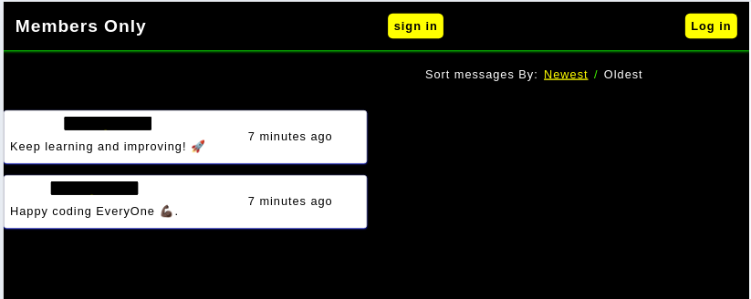
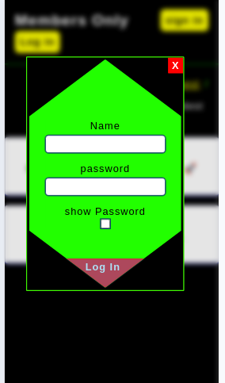
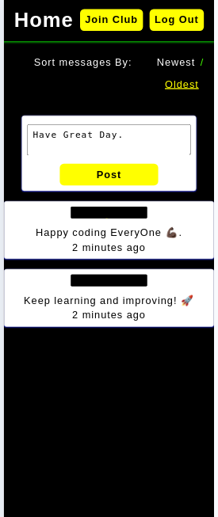

This is a solution to the [Members-Only] (https://www.theodinproject.com/lessons/node-path-nodejs-members-only) to The Odin project.

## Table of contents

- [The challenge](#the-challenge)
- [Screenshot](#screenshot)
- [Links](#links)
- [My process](#my-process)
  - [Built with](#built-with)
  - [What I learned](#what-i-learned)
  - [the struggle ](#struggle-on)
  - [Continued development](#continued-development)
  - [Useful resources](#useful-resources)
- [Author](#author)
- [Acknowledgments](#acknowledgments)

### The challenge

- sign in new users.
- log in singed in users.
- form validation for sign in,log in,join club and admin form.
- if they are logged in able to create messages.
- join the club using passcode for logged in user if they enter correctly.
- members who join club can be admin if they enter correct passcode.
- only admin able to delete messages.
- only members and admin can see the Author of the message.

- Bonus - sort messages by created date.
- update message time stamp periodically relative to current time using asynchronous function with date-fns module.

### Screenshot

### Links

- Live Site URL: [https://members-only-kuq1.onrender.com/]

## My process

- first time learning about using passport to authenticate users using sessions and cookies.

### Built with

- Semantic HTML5 markup
- CSS
- ejs
- psql
- node
  -passport
  -express
  -express-validator
  -express-session
  -date-fns

### What I learned

- authenticate users.
- give users different privileges (admin,member).
- using sessions and cookies to persist data.
- validating form and giving feedback to user.
- deploying and using database for production.

### struggle-on

- creating the session at first I thought pg-connect-simple create the table and I didn't know it must be created manually so I was confused when req.session.user return undefined.

- when I sort the messages it work but I use to update msg time stamp and when sorted the timestamp it was in-correct order it was always newest first, it didn't know the sort order changed based on user so I fix it by storing the chosen sort type using span element and use that as state to hold query to fetch message based on that sort type chosen.

### Continued development

- Learn more about passport strategies, sessions and cookies.

## acknowledgement

- render.com for hosting the app.
